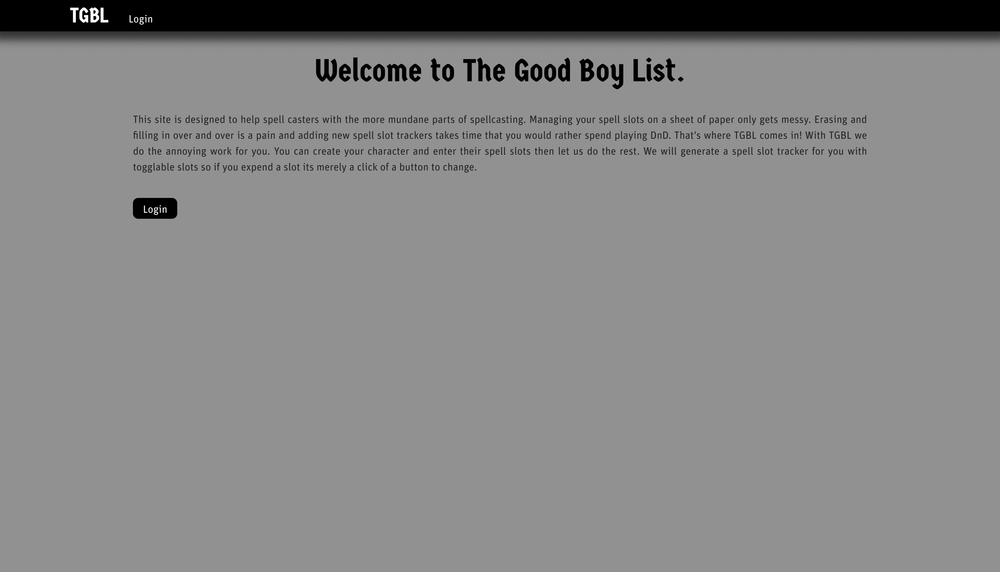
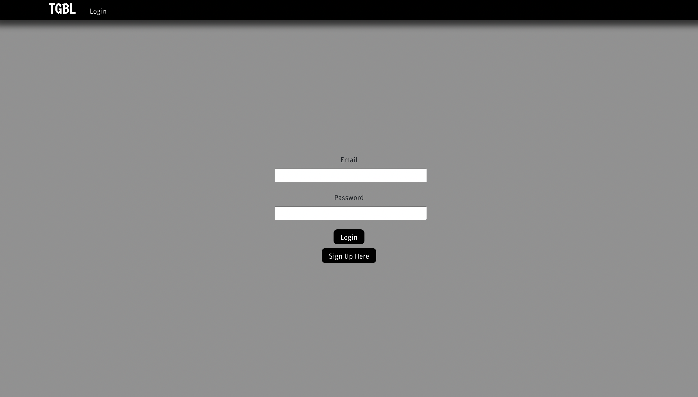
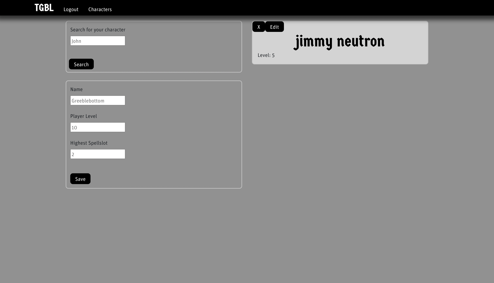
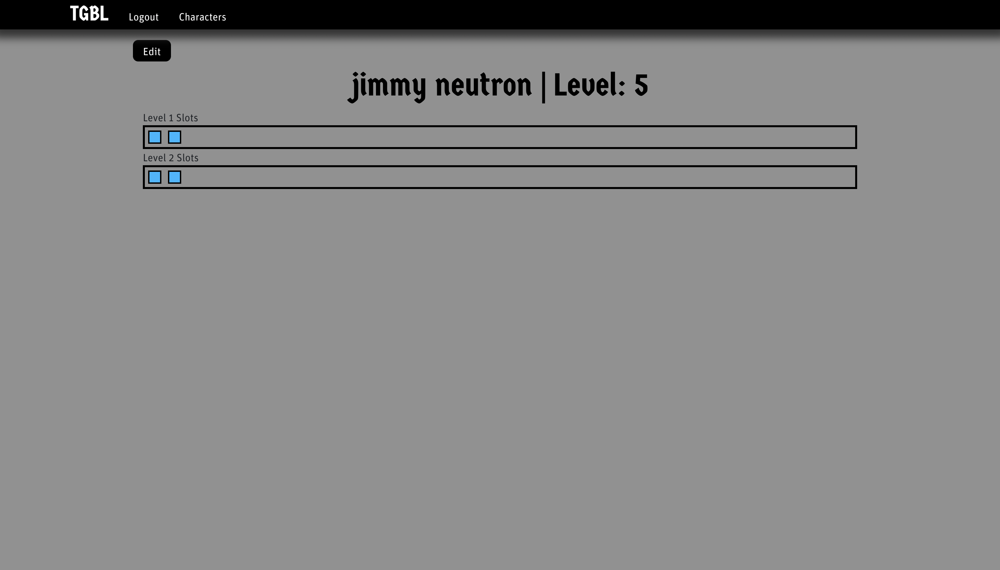
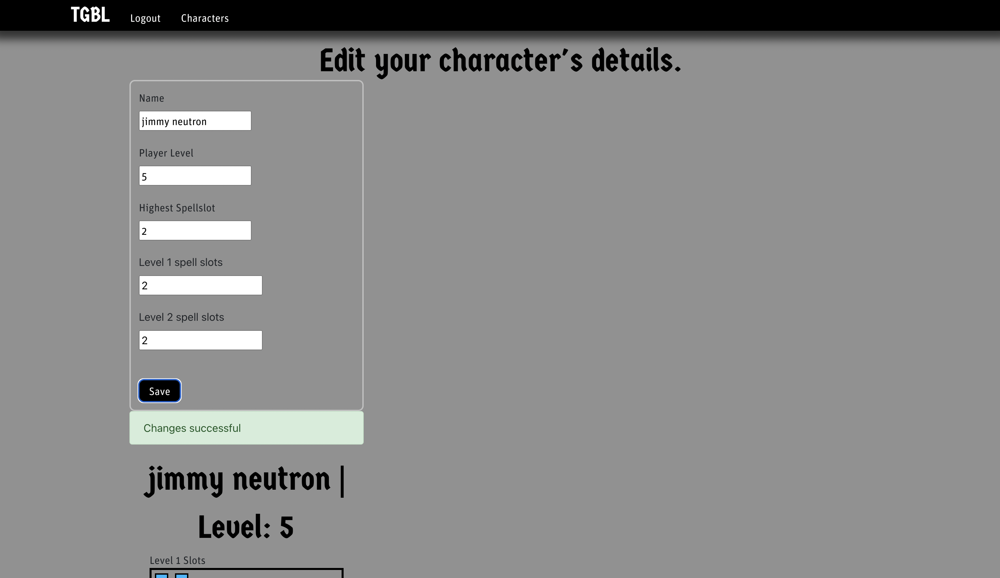

# TGBL
A spell slot tracker for DnD.

## Description
TGBL is a spell slot tracker for DnD that is simple to use. You can create your character and add their spell slots then use a simple toggle to say if they have been expended or not. Currently the site functions on client side storage, however, a backend exists for users and their characters which needs front-end integration before it becomes fully operational. If you want to use the client side storage version you can visit the deployed site link or use the heroku-stable-deploy branch locally.

## Usage
When you visit the website you will be greeted with the landing page. From here you can press either login button to go to the login/signup page.

On this page you can login or create an account that will store all of your created characters so you can access them anywhere and anytime.

After logging in/signing up you will move to the characters page where you can choose your character from a list of your created characters, search for a character by name, or create a new character. You can also delete characters or edit them using the button on the character cards.

If you create or select a character you will be redirected to the character display page where you can see your character and interact with the spell slots that the character has.

If your character levels up or changes in anyway you can change all their details from the character edit page.

## Installation
Clone the repo down to your machine and run

    npm i
  
You can then run the script

    npm run dev
    
To start the dev server

If you want to create a build of the app then all you have to do is run

    npm run build
    
Then you can start the server with 

    npm run start

## Contributers
[SquidDOTjpeg](https://github.com/SquidDOTjpeg)

## Links
[Deployed Site](https://thegoodboylist.herokuapp.com/)
